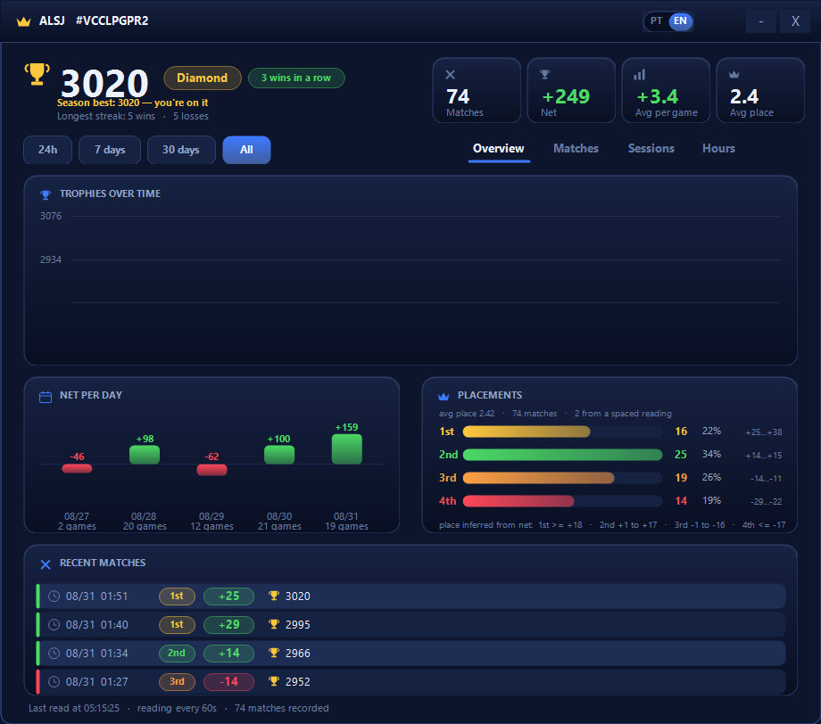
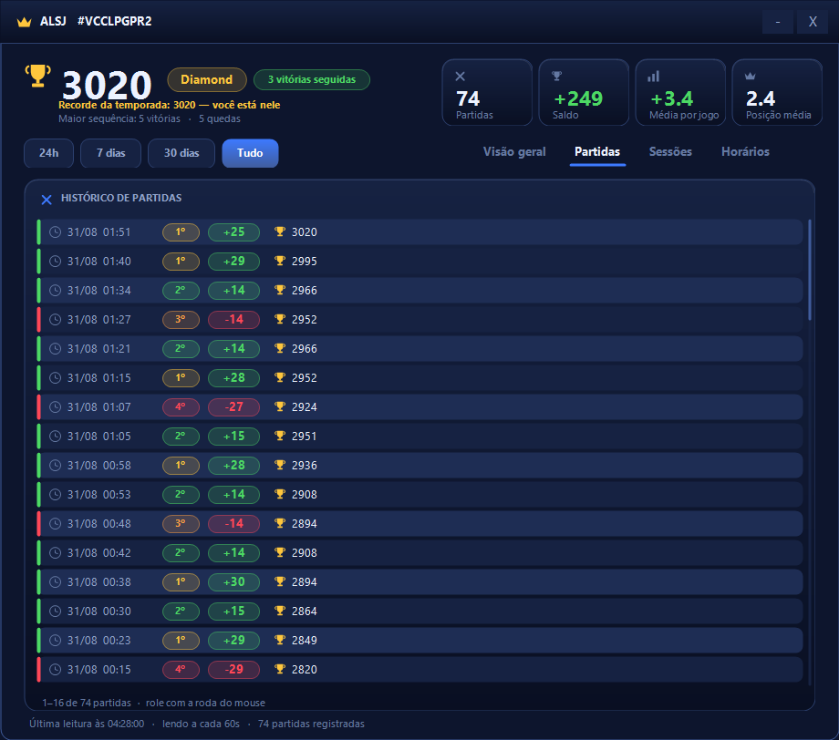
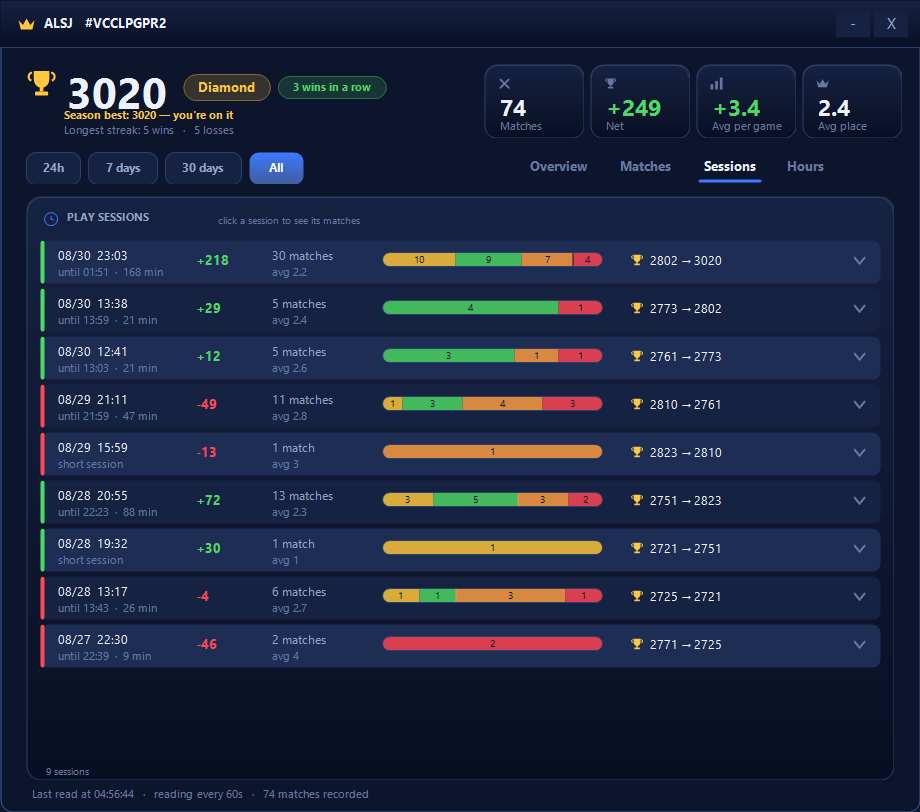
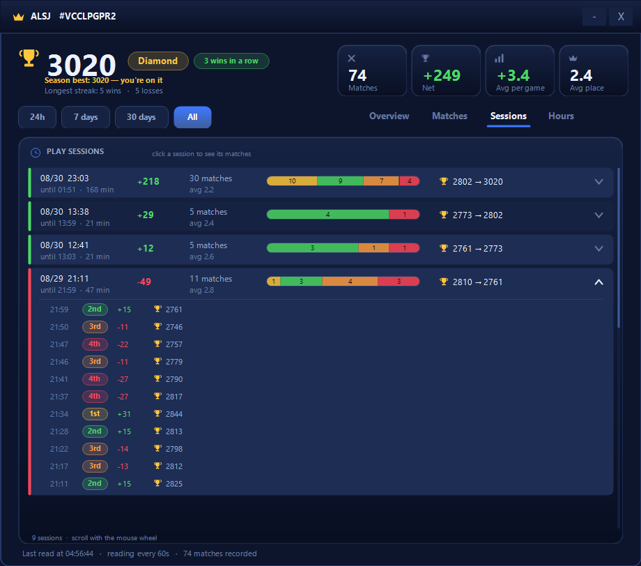
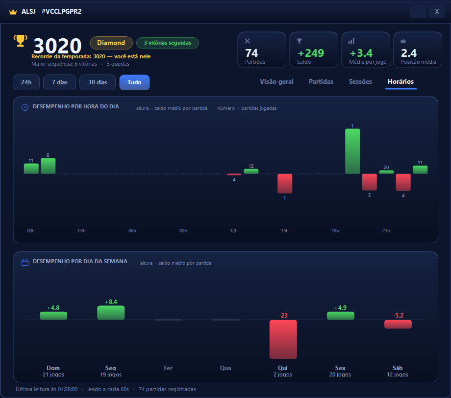

# Merge Tactics tracker

A tray app for Windows that tracks a Merge Tactics account over time, using the
**official Clash Royale API** as its only source. No third-party sites, no
scraping, and nothing to install: it runs on the SQLite and .NET that already
ship with Windows.

The game shows you a trophy count. It does not show you how you got there.
This does.



## Why it exists

The API exposes no battlelog for Merge Tactics — only the current trophy total.
The app reads that total every 60 s; each change is one match. From that single
number it reconstructs everything the game hides: per-match results, sessions,
placements, and time-of-day performance.

**Placement is inferred, never observed.** Supercell does not publish what each
position pays, but the observed trophy deltas cluster into four bands that do
not overlap:

| Place | Trophy delta | Observed (74 matches) |
|---|---|---|
| 1st | `>= +18` | +25 … +38 |
| 2nd | `+1 … +17` | +14 … +15 |
| 3rd | `-1 … -16` | -14 … -11 |
| 4th | `<= -17` | -29 … -22 |

No delta in the history lands anywhere near a boundary, so the mapping is
stable. The panel shows the observed range next to each position, so you can
check the inference against your own data rather than trusting it.

## What you get

**Overview** — trophies over time, net per day, and the placement breakdown.

**Matches** — the full history, scrollable, one row per game with its inferred
placement.



**Sessions** — matches less than 30 min apart count as one session. That is the
unit you actually feel while playing ("I played badly tonight"), and no screen
in the game shows it. Click a session to expand it into its individual games.




**Hours** — average net by hour of day and by weekday. Reveals when you play
well; nothing else crosses those two.



Every block re-filters at once through the period pills at the top
(24h / 7 days / 30 days / All).

## English and Portuguese

The interface ships in both. It follows the Windows display language on first
run, and you switch any time with the **PT | EN** toggle in the title bar,
with **Ctrl+L**, or from the tray menu. The choice is remembered across
restarts.


## Setup

1. **Get an API token** at [developer.clashroyale.com](https://developer.clashroyale.com).
   Save it in `token.txt` (see `token.txt.example`).
2. **Find your player tag** in the game profile and save it in `tag.txt`,
   including the `#` (see `tag.txt.example`).
3. Run `MergeTactics.bat`.

To start it with Windows, run `Install.ps1` once. `Uninstall.ps1` reverses
it and keeps your data.

Requires Windows 10/11 and PowerShell 5.1 (both preinstalled). No Python, no
runtime, no package manager.

## Keyboard and export

```
1 2 3 4    switch tabs
Esc        hide the window (collection keeps running)
F5         reload
Ctrl+L     switch language (English / Portuguese)
Ctrl+E     export the history to merge-tactics.csv on the desktop
```

CSV columns: `timestamp, local_time, delta, trophies, place, gap_s, reliable,
interval_s` — enough to redo the analysis elsewhere.

## How it stays alive

Two scheduled tasks, not one:

- `MergeTacticsTracker` fires at logon and runs `Start.vbs`.
- `MergeTacticsWatchdog` runs every 5 min and starts the collector **only if no
  instance is running**. It never opens the panel.

`Install.ps1` registers both; `Uninstall.ps1` removes them and keeps your data.

Without the watchdog, a mid-session crash went unnoticed until the next logon.
The timer tick is wrapped in try/catch and every exit is logged, so a silent
death leaves a trace.

## Known limits

- **The token dies on its own.** It is IP-locked (CIDR); on a residential
  connection the next renegotiation breaks collection with a 403. The app warns
  by toast but cannot recover: generate a new token and replace `token.txt`.
- **Placement is inferred**, never observed. Readings marked "spaced" may cover
  more than one match, and their placement is flagged as uncertain.
- **Comps and units do not exist in the API.**

## Files

```
MergeTactics.ps1   app: collection, queries, panel assembly
MtUi.ps1           visual components, drawn in GDI+
MtI18n.ps1         interface strings, English and Portuguese
MtLib.ps1          SQLite, network, alerts, log
MergeTactics.bat   launcher
Start.vbs          starts the collector with no console window
Watchdog.vbs       starts it only if no instance is running
Install.ps1        registers both scheduled tasks
Uninstall.ps1      removes them, keeps the data
Status.ps1         is it collecting?
Stop.ps1           stops the collector
mt.db              database        (not versioned)
token.txt          API credential  (not versioned)
tag.txt            player tag      (not versioned)
tracker.log        rotating log    (not versioned)
```

The `.ps1` files are stored as **UTF-8 with BOM**. Without the BOM, PowerShell
5.1 reads them as ANSI and mangles every accented character in the interface.

Portuguese documentation: [README.pt-BR.md](README.pt-BR.md).

## License

MIT — see [LICENSE](LICENSE).
