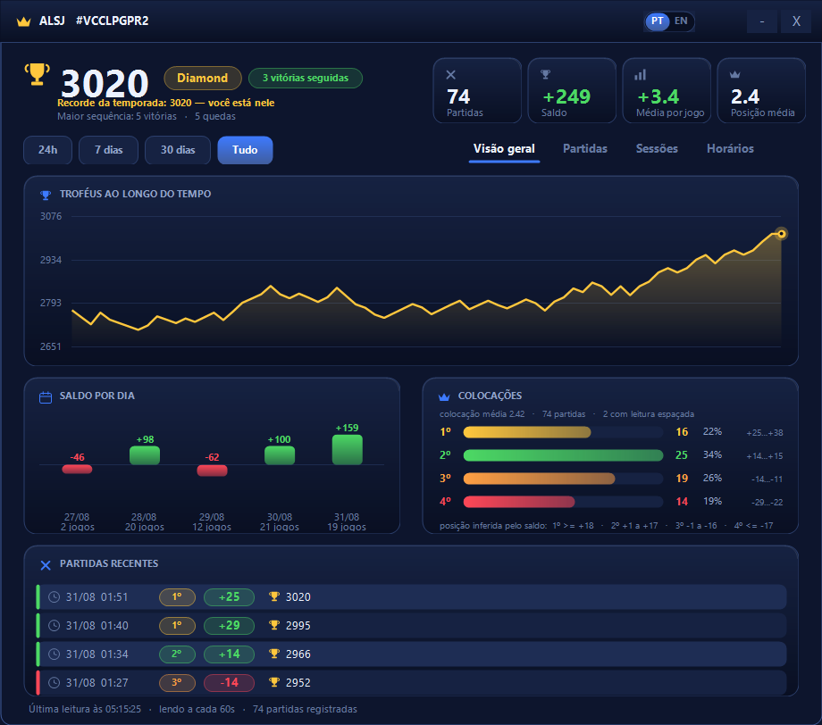
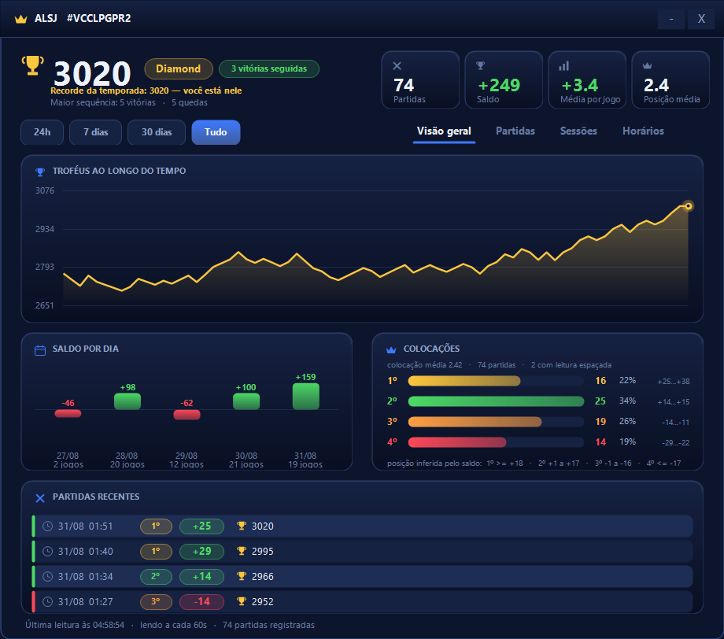
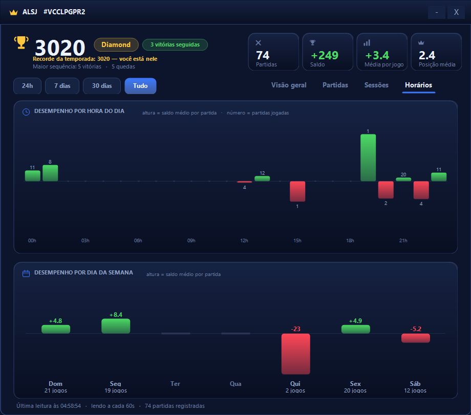

# Merge Tactics tracker (Windows)

App de bandeja que acompanha a evolução da conta de Merge Tactics.
Fonte única: **API oficial do Clash Royale**. Nenhum site de terceiros.

O jogo mostra um número de troféus. Ele não mostra como você chegou nele.
Isto mostra.

## Sem instalar nada

- **SQLite**: usa o `winsqlite3.dll` que já vem no Windows 11 (via P/Invoke).
- **Interface**: WinForms + GDI+, nativos do .NET Framework. A janela tem
  barra de título própria e componentes desenhados à mão: os controles
  nativos (ListView, borda da janela) não aceitam tema escuro.
- **Não precisa de Python.**

## Primeiro uso

1. Gere um token da API em [developer.clashroyale.com](https://developer.clashroyale.com)
   e salve em `token.txt` (veja `token.txt.example`).
2. Pegue a tag do jogador no perfil do jogo e salve em `tag.txt`, com o `#`
   (veja `tag.txt.example`).
3. Rode `MergeTactics.bat`.

| Ação | Como |
|---|---|
| Abrir o painel | duplo clique no ícone da bandeja, ou `MergeTactics.bat` |
| Iniciar | `MergeTactics.bat` (ou sozinho no logon) |
| Pausar / Sair | menu do botão direito no ícone |
| Parar tudo | `Stop.ps1` |
| Instalar no logon | `Install.ps1` |
| Remover do logon | `Uninstall.ps1` |
| Diagnóstico | `Status.ps1` |

O ícone da bandeja mostra os troféus atuais. Uma segunda execução do atalho
não cria outro coletor: ela apenas abre o painel da instância já rodando.

## Colocação inferida

A API não devolve a posição final da partida, só o saldo de troféus. Mas os
saldos observados se agrupam em quatro faixas que não se tocam, e cada faixa é
uma colocação:

| Colocação | Saldo | Observado (74 partidas) |
|---|---|---|
| 1º | `>= +18` | +25 … +38 |
| 2º | `+1 a +17` | +14 … +15 |
| 3º | `-1 a -16` | -14 … -11 |
| 4º | `<= -17` | -29 … -22 |

Nenhum saldo do histórico cai perto de uma fronteira, então a inferência é
estável. O painel mostra a faixa observada ao lado de cada posição — dá para
conferir a regra contra os seus próprios dados em vez de acreditar nela.

Leituras marcadas como espaçadas podem somar mais de uma partida; nelas a
colocação aparece com borda pontilhada e aviso.

## Abas

**Visão geral** — troféus ao longo do tempo, saldo por dia e o bloco de
colocações.

**Partidas** — o histórico inteiro, rolável, uma linha por jogo com a colocação
inferida.

**Sessões** — partidas separadas por menos de 30 min contam como uma sessão. É
a unidade que você percebe jogando ("hoje à noite fui mal"), e nenhuma tela do
jogo mostra isso. Cada linha traz duração, saldo, a mistura de colocações numa
barra empilhada e a variação de troféus. **Clique numa sessão** para abrir as
partidas dela, uma a uma.

**Horários** — saldo médio por hora do dia e por dia da semana. Revela em que
horário você rende mais; nenhuma outra fonte cruza isso.

O filtro de período no topo (**24h / 7 dias / 30 dias / Tudo**) refiltra todos
os blocos de uma vez.

## Português e inglês

A interface vem nos dois idiomas. Ela segue o idioma do Windows na primeira
execução, e dá para trocar a qualquer momento pelo botão **PT | EN** na barra
de título, por **Ctrl+L**, ou pelo menu da bandeja. A escolha fica gravada e
sobrevive ao reinício.

## Atalhos e exportação

    1 2 3 4    troca de aba
    Esc        esconde a janela (a coleta continua)
    F5         recarrega os dados
    Ctrl+L     troca o idioma (português / inglês)
    Ctrl+E     exporta o histórico para merge-tactics.csv na área de trabalho

Minimizar manda a janela para a bandeja, não para a barra de tarefas. O menu da
bandeja desliga isso se você preferir o botão na barra.

Colunas do CSV: `timestamp, local_time, delta, trophies, place, gap_s, reliable,
interval_s` — o bastante para refazer a análise fora do app.

## Cabeçalho

Troféus atuais, arena, sequência atual, recorde da temporada (dourado quando
você está nele, com a distância quando está abaixo) e a maior sequência de
vitórias e de quedas do período.

O painel se atualiza sozinho quando entra uma partida nova, sem perder a
posição da rolagem de quem estiver lendo o histórico.

## Como as partidas são detectadas

A API não expõe battlelog de Merge Tactics — apenas o total de troféus atual.
O app lê esse total a cada 60s; cada variação corresponde a uma partida. Se a
leitura demorar mais que o normal, duas partidas podem cair numa leitura só: a
linha vem marcada como espaçada.

## Vigia (religa sozinho)

Duas tarefas agendadas, não uma:

- `MergeTacticsTracker` — dispara no logon, roda `Start.vbs`.
- `MergeTacticsWatchdog` — a cada 5 min, roda `Watchdog.vbs`, que sobe o coletor
  com `-Watchdog` **apenas se não houver instância**. Nunca abre o painel.

Sem o vigia, uma morte no meio da sessão ficava até o próximo logon: foi o que
aconteceu em 28/08, o coletor sumiu às 10:19 e ninguém religou.

O tick do timer é todo protegido por try/catch. Antes, uma exceção em
`Get-MtInterval` ou `Update-MtTrayIcon` escapava do handler e derrubava o
processo sem escrever nada no log. Toda saída agora loga (`app encerrado` /
`MORTE:` com o número da linha).

## Limitações

- **O token morre sozinho.** Tem lock de IP (CIDR); numa conexão residencial a
  próxima renegociação do link quebra a coleta com 403. O app avisa por toast,
  mas não se recupera: gere outro em developer.clashroyale.com e substitua
  `token.txt`.
- **Colocação é inferida**, nunca observada.
- **Composições e tropas não existem na API.**

## Arquivos

    MergeTactics.ps1   app: coleta, consultas, montagem do painel
    MtUi.ps1           componentes visuais desenhados em GDI+
    MtI18n.ps1         textos da interface, inglês e português
    MtLib.ps1          SQLite, rede, alertas, log
    MergeTactics.bat   atalho de início
    Start.vbs          sobe o coletor sem janela de console
    Watchdog.vbs       só sobe se não houver instância
    Install.ps1        registra as duas tarefas agendadas
    Uninstall.ps1      remove as tarefas, preserva os dados
    Status.ps1         está coletando?
    Stop.ps1           encerra o coletor
    Test.ps1           confere as consultas e pinta cada bloco fora da tela
    mt.db              banco             (não versionado)
    token.txt          credencial da API (não versionada)
    tag.txt            tag do jogador    (não versionada)
    tracker.log        log rotativo      (não versionado)

Os `.ps1` são gravados em **UTF-8 com BOM**. Sem o BOM, o PowerShell 5.1 lê o
arquivo como ANSI e corrompe todos os acentos da interface.

## Desempenho

O painel recalcula só a aba que está à vista; as outras são preenchidas quando
abertas. O gráfico de troféus é reduzido à largura em que é desenhado, mantendo
as pontas e os picos. Com uma temporada de histórico (5.000 partidas), uma
partida registrada custa 77 ms de trabalho em vez de 1,2 s, e nenhuma interação
passa de ~70 ms.

O `Test.ps1` cobre a camada de consultas e pinta cada bloco, com dados e com
período vazio, nos dois idiomas.

## Licença

MIT — veja [LICENSE](LICENSE).
